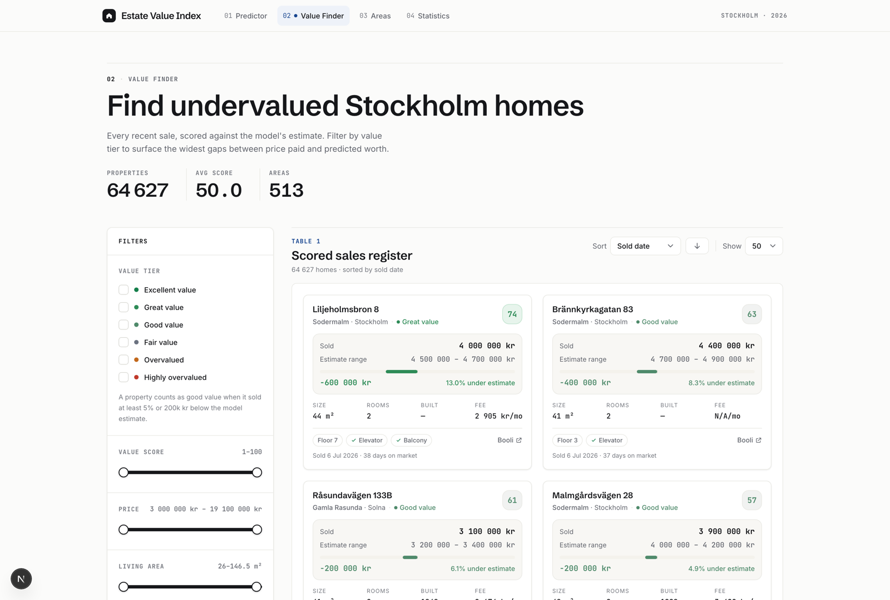

# Estate Value Index

 



This repo predicts sale prices for Swedish residential listings, end to end: ingest authorized
listing data, land it in BigQuery, engineer features, train LightGBM, and serve
predictions from a FastAPI + Next.js container on Cloud Run.

It is a working reference for the whole path, from ingestion to serving, rather
than a model in a notebook. The brittle parts are the ones real systems trip over:
temporal leakage in training, train/serve skew at inference, and untrusted input reaching
SQL or the file system.

The public repo ships code and synthetic fixtures only. Authorized listing records,
geocodes, trained models, private datasets,
and production metrics are left out. Bring your own lawful data access,
BigQuery, GCS, and `.env` for production-like runs.

## Stack

| Layer | Tech |
| ----- | ---- |
| Ingestion | Signed API and authorized export inputs |
| Warehouse | BigQuery |
| ML | pandas, scikit-learn, LightGBM, optional Optuna |
| API | FastAPI |
| Web | Next.js 16, React 19 |
| Orchestration | Prefect 3 |
| Deploy | Docker, Cloud Run, GCS |
| Tooling | Python 3.11+, Node 20+, uv, pytest, Jest |

## How it fits together

```text
Authorized listing source -> BigQuery raw listings -> engineered features -> LightGBM artifacts
  -> FastAPI /predict + Next.js API routes (one Cloud Run container)
```

The composed path is `pipelines/core/complete_pipeline.py`, which chains ingestion, feature
materialization, training, and deploy. Each stage also runs on its own (`data_pipeline.py`,
`training_pipeline.py`, `deployment_pipeline.py`). Start with
[docs/architecture.md](docs/architecture.md) for the full map.

## Setup

Prerequisites: Python 3.11+, Node 20+, `uv`. GCP/BigQuery/GCS access is needed for data and
production-like runs, not for the test suite.

```bash
git clone https://github.com/adamthuvesen/estate-value-index
cd estate-value-index

uv sync --all-extras

cd web && npm install && cd ..

cp .env.example .env   # then fill in GCP/BigQuery/GCS values
```

Minimal required environment (full list in [.env.example](.env.example)):

```bash
GCP_PROJECT_ID=your-gcp-project-id
GCP_REGION=europe-north1
BIGQUERY_PROJECT_ID=your-gcp-project-id
BIGQUERY_DATASET_RAW=booli_raw
BIGQUERY_TABLE_LISTINGS=listings
BIGQUERY_DATASET_FEATURES=booli_features
BIGQUERY_TABLE_FEATURES=engineered_features
GCS_BUCKET=your-gcs-bucket
```

Config precedence is environment variables -> [config/pipeline_config.yaml](config/pipeline_config.yaml)
-> code defaults. Inspect resolved settings with
`uv run python -m estate_value_index.utils.settings`.

## Run locally

One command starts both servers and regenerates the web app's derived data
(value analysis + area statistics) from the model in `web/models/` and the
local dataset:

```bash
./scripts/dev_web.sh                 # regenerates derived data if missing
./scripts/dev_web.sh --refresh-data  # force-regenerate (after new data/model)
./scripts/dev_web.sh --skip-data     # servers only, reuse existing data
```

- Web app: http://localhost:3000
- API docs: http://localhost:8000/docs

Needs a trained model in `web/models/`. Produce one (writes there by default):

```bash
uv run python -m estate_value_index.cli train-production-models --data-source bigquery
```

Env overrides: `WEB_DATA_FILE`, `API_PORT`, `WEB_PORT`. To run the servers by
hand instead, start `uvicorn api_server:app --port 8000` and `cd web && npm run
dev`, and set `PREDICTION_API_URL` if the API is not on `http://localhost:8000`.

## Data Access

This project is a modeling and systems prototype. It does not ship a dataset. Before running
ingestion against any third-party site or API, make sure you have the right to access the
data, follow the source's terms, and do not bypass access controls. Prefer signed APIs,
licensed exports, or other permissioned sources for real training data. The included
fixtures are synthetic and are the only data meant for public redistribution.

## Common tasks

```bash
# Test (Python coverage gate is 59%)
uv run pytest
cd web && npm test && cd ..

# Train production models locally
uv run python -m estate_value_index.cli train-production-models --data-source bigquery

# Run the pipeline (see --help for all flags)
uv run python -m estate_value_index.pipelines.core.complete_pipeline --quick      # fast local run
uv run python -m estate_value_index.pipelines.core.complete_pipeline --dry-run    # preview, no cloud work
uv run python -m estate_value_index.pipelines.core.complete_pipeline --retrain    # retrain existing data
uv run python -m estate_value_index.pipelines.core.complete_pipeline --retrain --deploy

# Backfill authorized listings through the signed API
uv run python -m estate_value_index.cli backfill --start-date 2026-01-01 --end-date 2026-01-31

# Deploy to Cloud Run
./scripts/deploy_cloud_run.sh
```

## Engineering decisions

Why the system is built the way it is, and the failure mode each choice guards against.

- **Chronological splits, never random.** Evaluation splits on `sold_date`. A random row
  split leaks future prices into training and flatters the metric, so area and time
  aggregates avoid future rows too.
- **Inference matches training.** Area normalization and the LightGBM categorical contract
  are shared between the trainer and `api_server.py`, not reimplemented on each side, which
  is where train/serve skew usually creeps in.
- **Models are verified, not trusted.** Serving checks `.sha256` sidecars and refuses to boot
  on a failed or partial download, so a bad sync fails loud instead of serving garbage.
- **Models live in GCS, not the image.** Training output is git-ignored and synced at boot, so
  the image stays generic and models version independently of deploys.
- **BigQuery SQL is parameterized or operator-only.** Dynamic SQL goes through
  `utils/bigquery_safety.py` with bound parameters; ad hoc strings are trusted operator input,
  never user data.
- **Least-privilege runtime.** Cloud Run reads its model bucket and nothing else: no BigQuery,
  no project Editor.

## Repository map

| Path | Purpose |
| ---- | ------- |
| `src/estate_value_index/ingestion/` | Listing ingestion, parsing, BigQuery load |
| `src/estate_value_index/pipelines/` | Prefect flows and tasks |
| `src/estate_value_index/ml/` | Feature engineering, data loading, training |
| `src/estate_value_index/monitoring/` | Model and data drift checks |
| `src/estate_value_index/utils/` | Settings, GCP clients, GCS, BigQuery safety |
| `web/src/app/` | Next.js pages and API routes |
| `config/`, `schemas/` | Pipeline/feature config and BigQuery schemas |
| `scripts/` | Deploy, startup, cloud setup, and research helpers |
| `tests/` | Python test suite |

Deeper docs: [data-pipeline.md](docs/data-pipeline.md),
[ml-and-models.md](docs/ml-and-models.md),
[api-web-deploy.md](docs/api-web-deploy.md).

## License

MIT. See [LICENSE](LICENSE).
